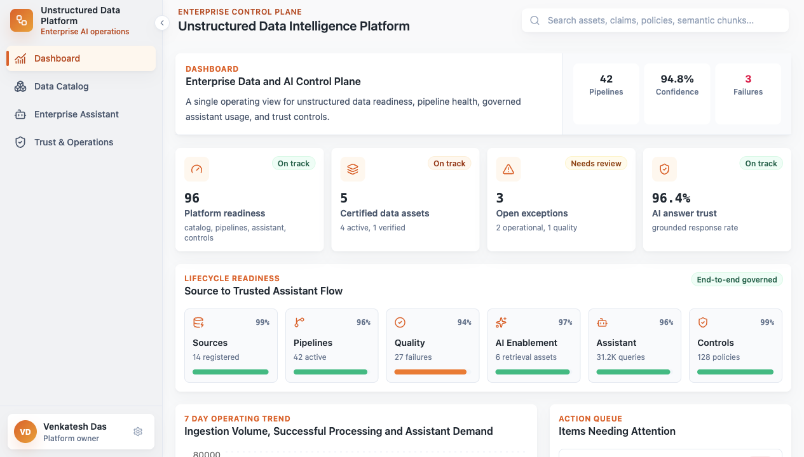
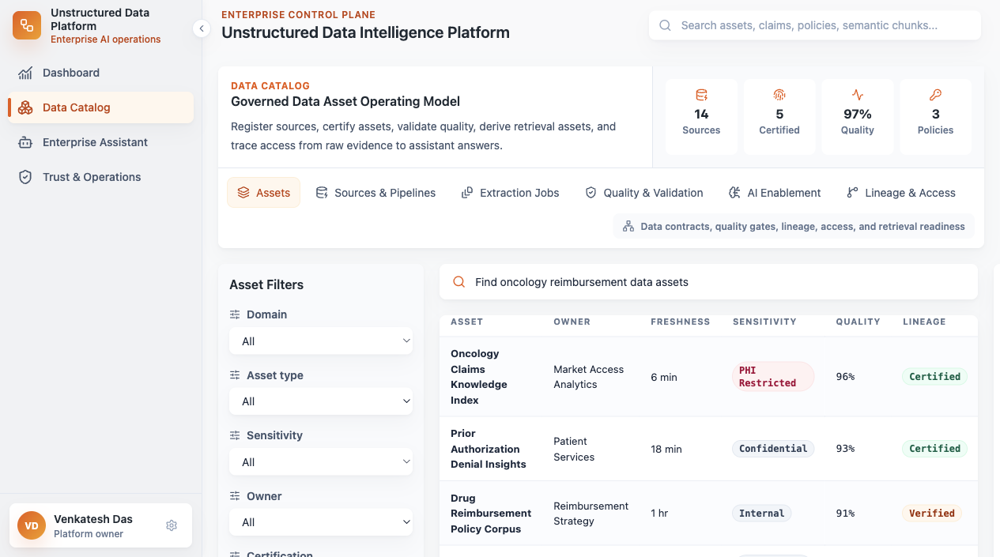
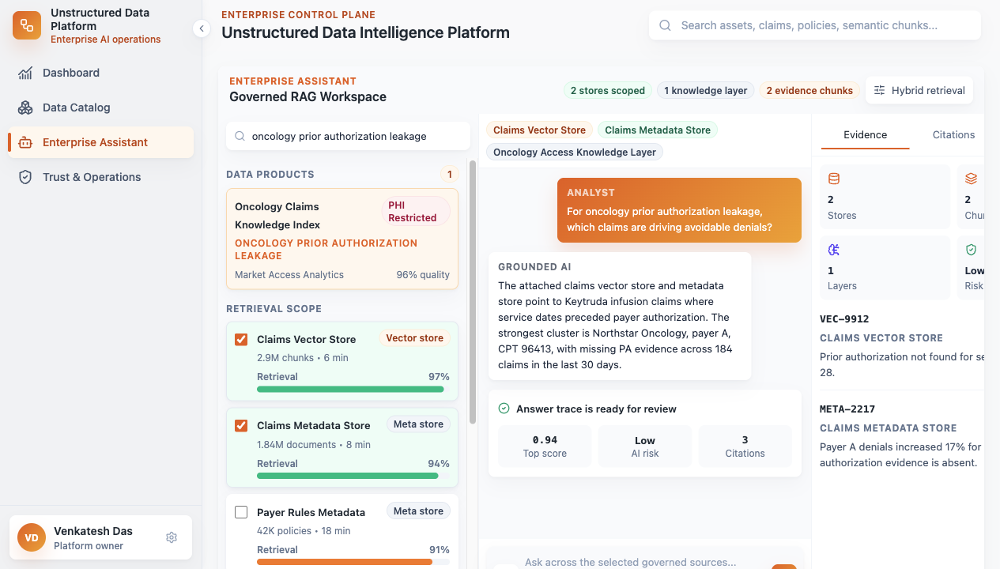
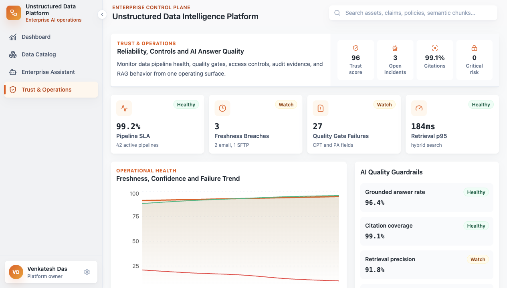

# Unstructured Data Platform

Enterprise unstructured data and AI operations platform prototype. The app demonstrates a governed control plane for source onboarding, data catalog operations, retrieval asset enablement, assistant workflows, and trust operations.

## Product Areas

- **Dashboard**: executive operating cockpit for data and AI readiness.
- **Data Catalog**: assets, sources, pipelines, extraction jobs, quality gates, AI enablement, lineage, and access.
- **Enterprise Assistant**: governed RAG workspace with scoped retrieval stores, chat, evidence, citations, and controls.
- **Trust & Operations**: reliability, incidents, policy enforcement, audit evidence, and AI quality guardrails.

## Screenshots

### Dashboard

Executive control plane for platform readiness, lifecycle health, operating trends, action queue, and workspace entry points.



### Data Catalog

Governed operating model for data assets, source pipelines, extraction jobs, quality gates, AI enablement, lineage, and access.



### Enterprise Assistant

Three-pane RAG workspace with data-product discovery, retrieval scope, governed chat, evidence, citations, and controls.



### Trust & Operations

Reliability and control surface for incidents, policy enforcement, AI quality, operational health, and audit evidence.



## Tech Stack

- React, TypeScript, Vite
- Tailwind CSS
- Recharts
- FastAPI mock backend

## Prerequisites

- Node.js 20+
- Python 3.11+

## Frontend Setup

```bash
npm install
npm run dev
```

The Vite dev server starts on the first available port, usually `http://localhost:3000` or `http://localhost:3001`.

## Backend Setup

```bash
python3 -m venv venv
source venv/bin/activate
pip install -r requirements.txt
uvicorn main:app --reload --port 8000
```

Health check:

```bash
curl http://localhost:8000/api/health
```

## Build

```bash
npm run build
```

The production build is emitted to `dist/`, which is intentionally ignored by git.

## Repository Notes

- Mock API data lives in `backend/repositories/mock_repository.py`.
- Frontend fallback data lives in `src/mockFallbacks.ts`.
- Generated artifacts such as `node_modules/`, `dist/`, Python caches, and TypeScript build info are ignored.
